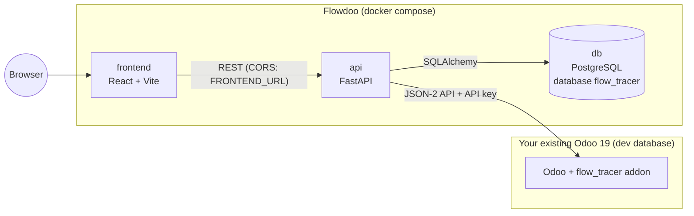
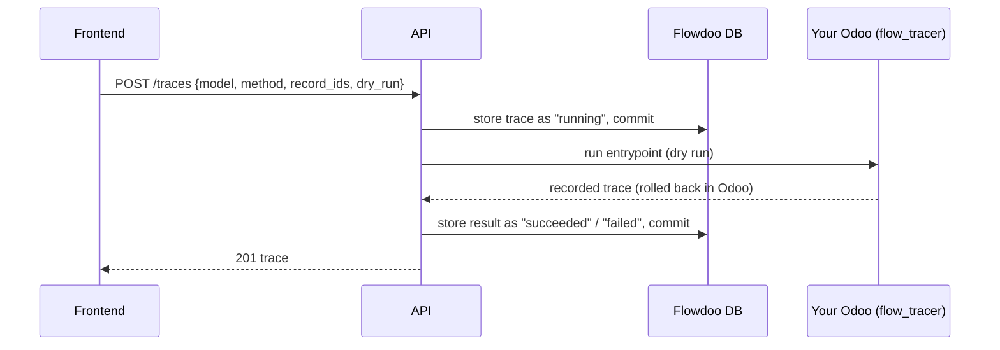
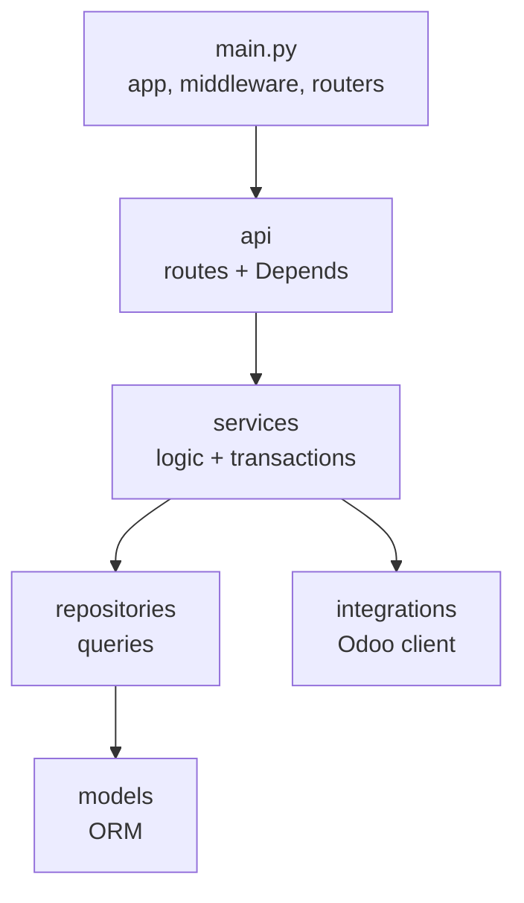

# Flowdoo – Odoo Workflow Tracer

Flowdoo makes complex Odoo flows visible. You pick an entrypoint such as
`sale.order.action_confirm`, Flowdoo runs it **in your own Odoo 19**, records every step
across models and modules, and lets you replay the run step by step: which method ran,
which module it came from, where it sits in the MRO, whether it calls `super()`, and which
field values changed. That shows you where you can hook in.

> [!WARNING]
> Flowdoo is meant for **development databases only**. Never point it at a production
> Odoo. Runs are dry runs by default (rolled back at the end), but the tool executes real
> business logic in the connected database.

## Status

The project is in an early stage. Recording works end to end through the API (backend →
addon → Odoo 19). The frontend has its foundation (app shell, data layer, fixture mode);
the trace views themselves are not built yet.

| Part | State |
|---|---|
| Backend API (`backend/`) | ✅ `/traces` records through the addon, validates and stores traces; `/odoo/status` checks the connection |
| Odoo recorder addon (`odoo-addons/flow_tracer`) | ✅ Recorder (`sys.monitoring`, [ADR 0001](docs/adr/0001-recorder-mechanism.md)), dry run, trace endpoint |
| Trace schema (`shared/schemas`) | ✅ v0.2.0 with generated types, hand-written and recorded fixtures ([format](docs/trace-format.md)) |
| Frontend (`frontend/`) | 🚧 Foundation: app shell, routing, API client, stores, fixture mode, UI primitives ([architecture](docs/frontend-architecture.md)); trace list and replay views are next |

## How it works

Flowdoo itself consists of three containers. **Your Odoo is not one of them:** Flowdoo
connects to the Odoo you already run, and you install the `flow_tracer` addon there.



- **`odoo-addons/flow_tracer`** runs inside your Odoo, records calls and value changes,
  executes the run in a transaction that is rolled back (dry run) and returns the trace.
- **`backend`** starts runs in your Odoo, stores traces in its **own** database (never in
  the Odoo database) and serves them to the frontend.
- **`frontend`** shows the trace as a timeline with replay. It talks only to the API.
- **`shared/`** holds the trace schema, the contract between the three parts.

Recording a trace:



The API never keeps a database transaction open while Odoo works, and a trace never stays
stuck in `running`.

## Tech stack

| Area | Technology |
|---|---|
| Backend | Python 3.12, FastAPI, Pydantic v2, SQLAlchemy 2 (async, asyncpg), Alembic, httpx |
| Tooling | uv, ruff, mypy (strict), import-linter, pytest + pytest-asyncio |
| Storage | PostgreSQL (own database `flow_tracer`, traces as JSONB) |
| Odoo | Odoo 19.0 Community, external JSON-2 API (`/json/2/<model>/<method>`) |
| Frontend | React 19, TypeScript (strict), Vite, React Router, Zustand, Radix (unstyled), React Flow (`@xyflow/react`), CSS Modules |
| Frontend tooling | pnpm, Vitest + Testing Library, ESLint, stylelint, Prettier, json-schema-to-typescript, openapi-typescript |
| Runtime | Docker Compose |

## Repository layout

```
.
├── backend/                 # API service (FastAPI)
│   ├── src/flow_tracer_api/
│   │   ├── main.py          # entrypoint: app factory, CORS, routers
│   │   ├── api/             # routes and dependency injection
│   │   ├── services/        # business logic, transactions, ports
│   │   ├── repositories/    # database access (only place with queries)
│   │   ├── integrations/    # clients for external systems (Odoo JSON-2)
│   │   ├── models/          # SQLAlchemy ORM models
│   │   ├── schemas/         # Pydantic models passed between layers
│   │   ├── domain/          # shared vocabulary (e.g. trace status)
│   │   ├── core/            # settings, database engine/session, logging
│   │   └── migrations/      # Alembic
│   └── tests/               # unit/ and integration/ (Postgres, Odoo)
├── frontend/                # UI (React + Vite), see docs/frontend-architecture.md
├── odoo-addons/flow_tracer/ # recorder addon for Odoo 19
├── shared/                  # trace schema and fixtures (the contract)
├── docs/                    # trace format, frontend architecture, ADRs
├── docker-compose.yml       # db, api, frontend; profile "test": odoo-test
└── .github/workflows/ci.yml
```

### Backend layers

Dependencies only point downwards. import-linter enforces this in CI.



`core`, `schemas` and `domain` can be used by every layer but import none of them.
Each request gets its own database session via `Depends`; the service builds its
repository on that session and decides when to commit. Service errors carry a message
and an HTTP status code; endpoints turn them into `HTTPException`s.

## Getting started

### Prerequisites

- Docker with Docker Compose
- [uv](https://docs.astral.sh/uv/) for local backend development
- An Odoo **19.0** with a development database, for tracing

### Run the backend

```sh
cp .env.example .env          # then set your own POSTGRES_PASSWORD (also in DATABASE_URL)
docker compose up -d db api   # add `frontend` for the UI on http://localhost:5173
```

On start, the `api` container runs `alembic upgrade head` (disable with
`RUN_MIGRATIONS=false`). Then:

- API docs (OpenAPI): <http://localhost:8000/docs>
- Health check: <http://localhost:8000/health>

### Connect your Odoo

1. Install the addon in your Odoo and switch it on, see
   [`odoo-addons/flow_tracer/README.md`](odoo-addons/flow_tracer/README.md). Use a
   neutralised development database (`odoo neutralize -d <db>`).
2. In Odoo, create an API key for a user in the *Settings* group:
   *Preferences → Account Security → New API Key*.
3. Set in `.env`:

   | Variable | Meaning |
   |---|---|
   | `ODOO_URL` | URL of your Odoo as seen from the `api` container, e.g. `http://host.docker.internal:8069` |
   | `ODOO_DB` | Your development database |
   | `ODOO_API_KEY` | The API key (never logged, never stored) |
   | `ODOO_LOGIN` | Optional: the login the key must belong to |

4. Restart the API and check the connection:

   ```sh
   docker compose up -d api
   curl http://localhost:8000/odoo/status
   ```

   `ok: true` means: reachable, Odoo 19.0, valid key, `flow_tracer` installed and switched
   on, recorder available, key user is an administrator. Otherwise `problems` says what is
   missing; `warnings` reports e.g. a database that is not neutralised.
5. Record a run:

   ```sh
   curl -X POST http://localhost:8000/traces -H "Content-Type: application/json" \
     -d '{"entrypoint_model": "sale.order", "entrypoint_method": "action_confirm", "record_ids": [1]}'
   ```

   Methods with parameters take `kwargs` (as in Odoo's JSON-2 API), e.g.
   `{"entrypoint_model": "res.partner", "entrypoint_method": "write", "record_ids": [7],
   "kwargs": {"vals": {"name": "New name"}}}`. Model-level methods are called without
   `record_ids`. `GET /odoo/entrypoints/res.partner/write` shows what a method expects.

### Configuration

All settings come from environment variables (`.env`), read centrally in
`backend/src/flow_tracer_api/core/config.py`. `.env.example` documents every variable.
The most important ones besides the Odoo connection:

| Variable | Meaning |
|---|---|
| `DATABASE_URL` | Flowdoo's own database (`postgresql+asyncpg://…`), never the Odoo database |
| `FRONTEND_URL` | URL of the frontend; the only origin allowed to call the API |
| `ALLOW_NON_DRY_RUN` | `false` by default. `true` allows runs that are **not** rolled back |
| `RUN_MIGRATIONS` | Run migrations on container start (default `true`) |

## API overview

| Method | Path | Purpose |
|---|---|---|
| `GET` | `/health` | Liveness |
| `GET` | `/odoo/status` | Check the connection to your Odoo |
| `GET` | `/odoo/entrypoints/{model}/{method}` | Parameters of a method before tracing it |
| `POST` | `/traces` | Record a run in your Odoo (`201`; `503` if no Odoo is configured) |
| `GET` | `/traces` | List traces (filters, paging, without payload) |
| `GET` | `/traces/{trace_id}` | One trace with payload |
| `DELETE` | `/traces/{trace_id}` | Delete a trace |

The full, always current description is the OpenAPI page at `/docs`.

## Development

### Backend

```sh
cd backend
uv sync                                    # install dependencies into backend/.venv
uv run uvicorn flow_tracer_api.main:create_app --factory --reload

uv run ruff check . && uv run ruff format --check .
uv run mypy
uv run lint-imports --no-cache
uv run pytest -m "not integration and not odoo"   # unit tests, no services needed
uv run pytest                                     # + integration tests (needs `docker compose up -d db`)
```

Test markers:

| Marker | Needs |
|---|---|
| *(none)* | nothing, runs in CI |
| `integration` | the compose `db` (tests use their own `<db>_test` databases) |
| `odoo` | the Odoo 19 test container, see [`backend/tests/integration/odoo/README.md`](backend/tests/integration/odoo/README.md) |

The test Odoo is started with the compose profile `test`:
`docker compose --profile test up -d odoo-test`.

### Frontend

```sh
cd frontend
corepack enable                 # pnpm in the version pinned in package.json
pnpm install
pnpm dev                        # http://localhost:5173, talks to VITE_API_URL
VITE_DATA_SOURCE=fixtures pnpm dev   # without backend and Odoo, on shared/fixtures

pnpm lint                       # ESLint, stylelint, Prettier
pnpm typecheck
pnpm test
pnpm build
pnpm gen:types                  # after a schema or API change (needs uv for the OpenAPI dump)
```

The data source can also be switched at runtime in the top bar. `/_kit` (development only)
shows all UI primitives in light and dark. Layers, data flow, conventions and a checklist
for new features: [docs/frontend-architecture.md](docs/frontend-architecture.md).

| Variable (`frontend/.env.local`) | Meaning |
|---|---|
| `VITE_API_URL` | Base URL of the Flowdoo API (default `http://localhost:8000`) |
| `VITE_DATA_SOURCE` | `api` (default) or `fixtures` |

### Git hooks

```sh
git config core.hooksPath .githooks
```

The pre-commit hook refuses commits on `main`, formats staged backend files with ruff and
aborts on lint findings.

### Workflow

1. Branch from the current `main`: `<type>/<short-description>`
   (`feat/`, `fix/`, `chore/`, `docs/`, `refactor/`, `test/`, `ci/`, `spike/`).
2. Small commits in [Conventional Commits](https://www.conventionalcommits.org/) format,
   e.g. `feat(backend): add odoo status endpoint`.
3. Push and open a pull request against `main`. `main` is protected; changes only land
   through reviewed pull requests.
4. CI must be green.

### Continuous integration

Every pull request runs:

| Job | Checks |
|---|---|
| ruff | lint and formatting |
| mypy | strict type checking |
| import-linter | backend layer contracts |
| unit tests | `pytest -m "not integration and not odoo"` |
| backend generated types | regenerated from `shared/schemas`, no diff |
| frontend | lint (ESLint, stylelint, Prettier), typecheck, Vitest, build |
| frontend generated types | regenerated from `shared/schemas` and the backend's OpenAPI, no diff |

## License

No license has been chosen yet.
