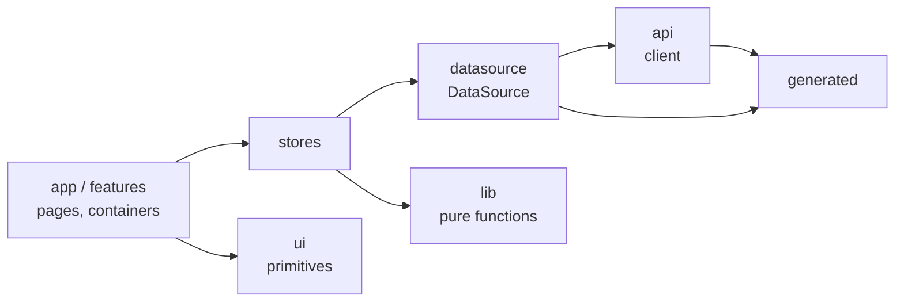
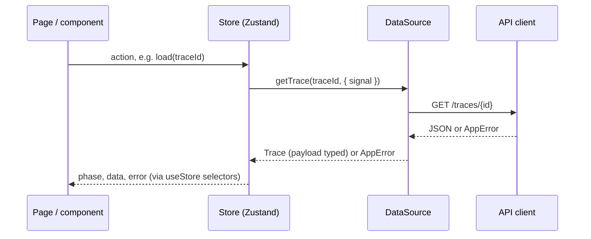

# Frontend architecture

The frontend (`frontend/`) is a React 19 + TypeScript (strict) single-page app built with
Vite. It shows recorded traces and, later, the static overview. It talks only to the
Flowdoo API, never to Odoo, and works completely without a backend in **fixture mode**.

Decisions are recorded in ADRs:
[0002 toolchain](adr/0002-frontend-toolchain.md),
[0003 type generation](adr/0003-frontend-type-generation.md),
[0004 data sources](adr/0004-frontend-data-sources.md),
[0005 routing and app shell](adr/0005-frontend-routing-and-shell.md).

## Layers

```
frontend/src/
├── generated/     # types from shared/schemas and the backend's OpenAPI (never edited)
├── api/           # HTTP client: fetch, timeouts, AppError
├── datasource/    # DataSource interface; API and fixture implementations
├── stores/        # Zustand vanilla stores (state + actions), one set per data source
├── lib/           # pure logic without React: replay core, shortcut matching, theme
├── ui/            # presentational primitives (no stores, no data access)
├── app/           # composition: providers, router, shell, pages, dev-only /_kit
├── features/      # feature modules (trace list, start dialog, replay, …), still empty
├── styles/        # tokens.css (all design values), base.css
└── test/          # test setup (jsdom stubs)
```

Dependencies point one way:



Rules (by convention and review; not yet enforced by lint):

- `ui/` never imports from `stores/`, `datasource/` or `api/`. Components get data via props.
- Only `api/` calls `fetch`. Only `datasource/` uses the client. Components never call either.
- `lib/` has no React and no I/O, so it is tested as plain functions.
- `generated/` is written by `pnpm gen:types` only; CI fails on a diff.

## Data flow



- **Stores** (`stores/`): `connection` (`/odoo/status`), `traceList`, `currentTrace`
  (load with abort, synchronous start of a run), `replay` (cursor, playing, speed).
  `createAppStores(source)` creates and wires one set for a data source. Every store has a
  `phase` (`idle | loading | ready | error`) and an `error: AppError | null`, so each view
  can render loading, empty and error states the same way.
- **Errors:** everything thrown below the stores becomes an `AppError` with a `kind`
  (`http`, `validation`, `network`, `timeout`, `aborted`, `unexpected`), an HTTP `status`
  where there is one, and field errors for `422`. The UI shows the `message`. Nothing
  is logged to the console; trace values can be sensitive.
- **In React:** `AppProviders` puts the store set in context; components read it with
  `useStores()` and zustand's `useStore(store, selector)`. Select single fields (or use
  `useShallow`), never whole new objects.
- **Replay core** (`lib/replay/`): `indexTrace` builds the order (`seq`), the call tree
  (`parent_id`) and lookups once per trace; cursor functions clamp and never wrap. The
  replay store only holds the cursor; views derive everything else from the index.

## Fixture mode

`VITE_DATA_SOURCE=fixtures`, or the "Use Fixtures" switch in the top bar, replaces the API
with `createFixtureDataSource()` on `shared/fixtures/*.json`. It behaves like the API
(filters, paging, 404, delete, start of a run, refusal of `dry_run=false`, a failed
recording) with an artificial delay, so loading states are visible. The connection notice
says that fixture mode is active. Details in ADR 0004.

The switch in the top bar wins over the environment variable until switched back
(`localStorage` key `flowdoo.dataSource`).

## App shell and routing

- Routes: `/` → `/traces`, `/traces`, `/traces/:traceId`, `/overview`, not-found. `/_kit`
  is a development-only gallery of the UI primitives (light and dark), not in production
  builds.
- `AppShell` (layout route) renders the top bar and the connection notices: dry-run badge,
  connection state, data source, theme, shortcut help. Pages fill the rest and compose
  `SplitPanel` (left, main, right; resizable, persisted) and an optional `BottomBar`.
- Pages load their data by calling store actions in effects. The router has no loaders.

## Keyboard

- One `keydown` listener (`ShortcutProvider`). Register a shortcut with
  `useShortcut({ id, key, label, description, group }, run)` while a component is mounted.
- Shortcuts are single keys (`event.key`). Combinations with Ctrl, Meta or Alt are never
  taken. Keys in form controls (inputs, sliders, selects, checkboxes) belong to the control,
  and Space or Enter on a button or link activates it instead of running a shortcut.
- Widgets with their own arrow keys (`Table`, `Tree`) handle them and call
  `preventDefault()`, so global shortcuts such as the replay's ←/→ do not fire twice.
- `?` opens the help dialog, which lists everything registered at that moment.
- Every control is a native button or link or has an ARIA role with keyboard handling
  (`SplitPanel` handles: arrows, Home/End, Enter). `:focus-visible` shows a ring
  everywhere. Dialogs trap focus and return it on close.

## Styling

- **CSS Modules** per component, camelCase class names. No CSS-in-JS, no utility
  framework, no styled UI kit (Radix is used unstyled for behavior: tooltip, tabs, dialog).
- **Tokens only.** All colors, font sizes, spacing, radii, shadows and sizes are custom
  properties in `styles/tokens.css`, with a dark theme under `[data-theme="dark"]`.
  stylelint (`stylelint.config.js`) and ESLint (`eslint.design-rules.js`) reject raw
  colors, gradients, blur, other shadows, font sizes and spacing outside the scale.
  `lint/design-rules.test.js` tests those rules.
- **Contrast:** `styles/contrast.test.ts` checks the token pairs against WCAG AA in both
  themes.
- **Icons:** Lucide only, through `ui/Icon` (one size, one stroke width).
- **Theme:** follows the system until the user picks one (`flowdoo.theme`). It is applied
  before the first render.
- `node .claude/skills/avoid-ai-design/scripts/detect.mjs frontend/src` (from the repo
  root) scans for generic design defaults. UI pull requests list its result.

## Adding a feature

1. **Data:** if the API is missing something, change the backend first and run
   `pnpm gen:types`. Never hand-write API or trace types.
2. **DataSource:** add the method to the interface and to *both* implementations. Make
   the fixture version behave like the API, including its errors. Add tests for both.
3. **Store:** state with `phase` and `error`, and actions as function properties. A newer
   request supersedes an older one (abort or request counter). Test it with the fixture
   source.
4. **Pure logic** goes to `lib/` with unit tests.
5. **UI:**
   - Put the view in `features/<name>/`. A container reads stores; presentational parts
     take props.
   - Use primitives from `ui/`. A new primitive needs a reason and tests (rendering,
     keyboard, focus).
   - Handle loading, empty and error states, each with one sentence and at most one
     primary action.
6. **Keyboard:** register shortcuts via `useShortcut`; they appear in the help dialog
   automatically.
7. **Route:** add the route in `app/AppRoutes.tsx`. It loads data via store actions.
8. **Check:**
   - `pnpm lint`, `pnpm typecheck`, `pnpm test` and `pnpm build` pass.
   - The design scan is clean.
   - Look at it in light and dark, with the API and with fixtures.

## Conventions

- TypeScript strict with `noUncheckedIndexedAccess`; no `any`; no non-null assertions
  outside tests.
- Imports via `@/…` (`src/`) and `@shared/…` (`../shared`).
- `GraphCanvas` and `GraphNode` are imported from their files (`@/ui/GraphCanvas`), not
  from the `@/ui` barrel, so React Flow only loads with the views that draw graphs. The
  trace view is a lazy route for the same reason.
- Tests sit next to the code (`*.test.ts(x)`), run with Vitest and jsdom, and use Testing
  Library queries by role and accessible name. Use fixtures with `delayMs: 0`, not
  hand-made mocks, wherever a data source is needed.
- No `console.*` (lint error). No payloads in logs or error messages beyond what the API
  returned.
- UI text is English and sentence case. Technical identifiers (models, methods, modules,
  ids) are shown exactly and in the mono face.

## Commands

From `frontend/` (pnpm is pinned in `package.json`; enable it with `corepack enable`):

| Command | Does |
|---|---|
| `pnpm install` | install dependencies |
| `pnpm dev` | dev server on <http://localhost:5173> (`/_kit` for the UI kit) |
| `pnpm build` | typecheck and production build to `dist/` |
| `pnpm typecheck` | `tsc -b --noEmit` |
| `pnpm lint` | ESLint, stylelint and Prettier check |
| `pnpm fmt` | Prettier, then ESLint and stylelint with `--fix` |
| `pnpm test` / `pnpm test:watch` | Vitest once / in watch mode |
| `pnpm gen:types` | regenerate `src/generated/` from `shared/schemas` and the backend's OpenAPI (needs `uv`) |

In Docker: `docker compose up -d frontend` runs the dev server with hot reload. It also
starts `api` and `db` (`depends_on`). Your source is mounted, and `shared/` is mounted
read-only for fixture mode.

## CI

Two jobs run for the frontend:

- **Frontend · lint, typecheck, test, build**
- **Frontend · generated types up to date**, which regenerates the types and fails on a
  diff.
