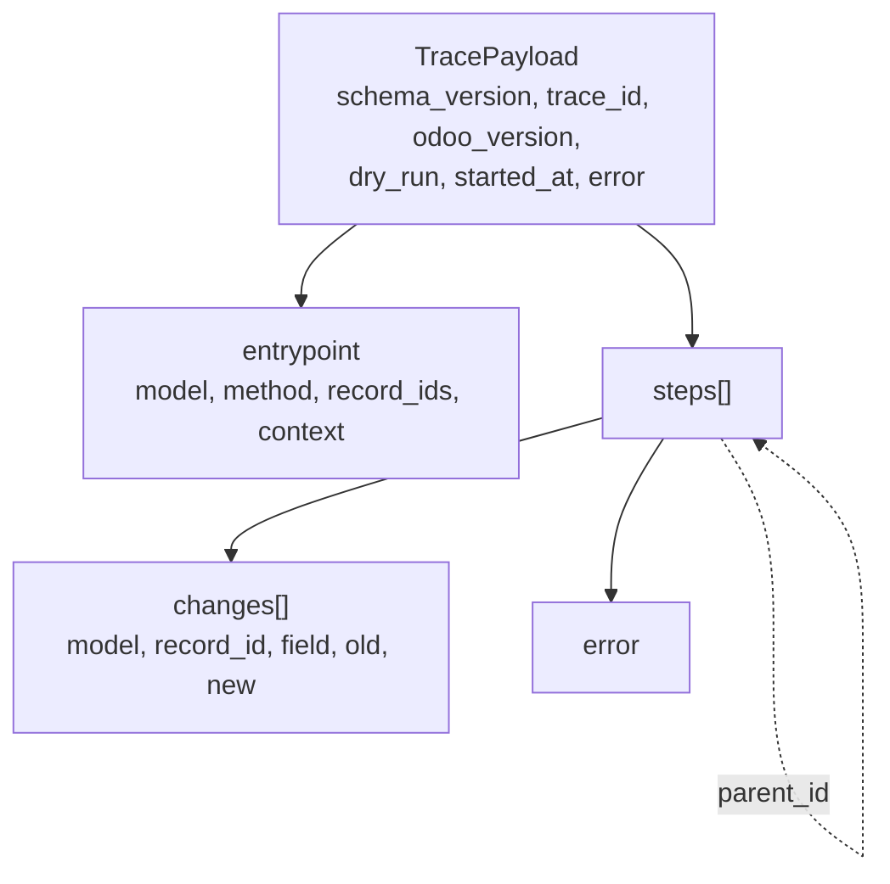

# Trace format (schema v0.1.0)

A trace is one recorded run of an Odoo entrypoint. Its format is the contract between the
recorder (Odoo addon), the backend and the frontend.

- **Source of truth:** [`shared/schemas/trace.schema.json`](../shared/schemas/trace.schema.json)
  (JSON Schema 2020-12). This page explains it; if they disagree, the schema wins.
- **Examples:** [`shared/fixtures/`](../shared/fixtures/) (small, medium, error).
- **Backend types:** generated into `backend/src/flow_tracer_api/generated/trace_schema.py`
  by `backend/scripts/gen_types.sh`. Never edit them by hand; CI fails if they are out of date.

## Overview

All objects reject unknown properties. Fields marked *nullable* are always present but may
be `null`.

## Trace

| Field | Type | Meaning |
|---|---|---|
| `schema_version` | `"0.1.0"` | Version of this format |
| `trace_id` | UUID | Assigned by the backend before the run |
| `odoo_version` | string (≤ 32) | Odoo series, e.g. `"19.0"` |
| `dry_run` | boolean | `true`: the run was rolled back at the end |
| `started_at` | date-time with timezone | Start of the run |
| `entrypoint` | object | What was run, see below |
| `steps` | array (≤ 20 000) | Recorded events |
| `error` | error, nullable | Set if the entrypoint itself raised |

### Entrypoint

| Field | Type | Meaning |
|---|---|---|
| `model` | model name (≤ 128) | e.g. `"sale.order"` |
| `method` | identifier (≤ 128) | e.g. `"action_confirm"` |
| `record_ids` | ids (≤ 1000) | Records the method was called on |
| `context` | object | Context of the call |

## Steps

Each step is one event: a method call, an ORM operation, a compute, and so on.

- **Order:** `seq` (1, 2, 3, …) is the replay order and is unique within a trace. The array
  order carries no meaning.
- **Call tree:** `parent_id` points to the step that caused this one; `null` for
  top-level steps. Every `parent_id` must be the `id` of another step in the same trace.

| Field | Type | Meaning |
|---|---|---|
| `id` | string (≤ 32) | Unique within the trace, e.g. `"s1"` |
| `parent_id` | string, nullable | Calling step |
| `seq` | integer ≥ 1 | Replay position |
| `kind` | enum | See below |
| `model` | model name | Model the step ran on |
| `method` | identifier | Method (for ORM steps: `create`, `write`, `unlink`) |
| `module` | identifier, nullable | Module whose implementation ran, e.g. `"sale_stock"` |
| `mro_position` | integer ≥ 0, nullable | Index of that implementation in the MRO, 0 = most derived |
| `calls_super` | boolean, nullable | Whether the implementation called `super()` |
| `record_ids` | ids (≤ 1000) | Records involved |
| `args_summary` | text (≤ 2000), nullable | Shortened arguments |
| `return_summary` | text (≤ 2000), nullable | Shortened return value |
| `changes` | array (≤ 1000) | Field values the step changed |
| `duration_ms` | number ≥ 0 | Wall time including child steps |
| `error` | error, nullable | Set if the step raised |

`null` for `module`, `mro_position` or `calls_super` means **not determined**. The recorder
must not guess. If it uses a heuristic, it marks that in the documentation of the recorder.

### Step kinds

| `kind` | Meaning |
|---|---|
| `method_call` | A model method ran |
| `orm_create` / `orm_write` / `orm_unlink` | ORM write operation |
| `compute` | A computed field was (re)computed |
| `onchange` | An onchange ran |
| `constraint` | A constraint was checked |
| `automation` | An automated action ran |
| `side_effect_blocked` | A side effect that cannot be rolled back (mail, HTTP, payment, …) was **not** executed in a dry run |

## Field changes

| Field | Type | Meaning |
|---|---|---|
| `model` | model name | Model of the changed record |
| `record_id` | integer ≥ 1 | Changed record |
| `field` | identifier | Field name |
| `old` / `new` | value | Value before / after the step |

Values are serialised like this:

| Odoo value | In the trace |
|---|---|
| empty / `False` for non-boolean fields | `null` |
| boolean, integer, float | JSON boolean or number |
| char, selection, text | string (≤ 2000, truncated) |
| many2one, one2many, many2many | list of ids, e.g. `[12]` (never records) |
| date, datetime, binary, others | shortened string, e.g. `"2026-10-03 12:00:00"` or a size note for binaries |

## Errors

| Field | Type | Meaning |
|---|---|---|
| `type` | string (≤ 256) | Qualified exception class, e.g. `"odoo.exceptions.UserError"` |
| `message` | string (≤ 4000) | Exception message |

No tracebacks are stored.

## Validation in the backend

The backend accepts a trace only if it matches the generated model and these rules, which
JSON Schema cannot express:

- step `id`s are unique
- step `seq` values are unique
- every `parent_id` refers to another existing step

Invalid traces are stored with status `failed` and the reason as error text. Valid traces
are stored exactly as received.

## Changing the format

1. Change `shared/schemas/trace.schema.json` and bump `schema_version` (semver; breaking
   changes bump the major version).
2. Run `backend/scripts/gen_types.sh`.
3. Update the fixtures, the recorder, the backend and the frontend; all tests green.
4. Update this page. Everything in the same pull request.

Masking of sensitive values is not part of v0.1.0 and will be added in a later version.
